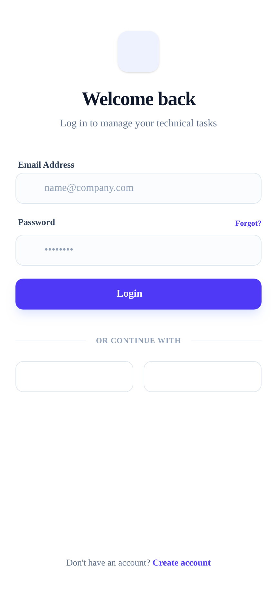
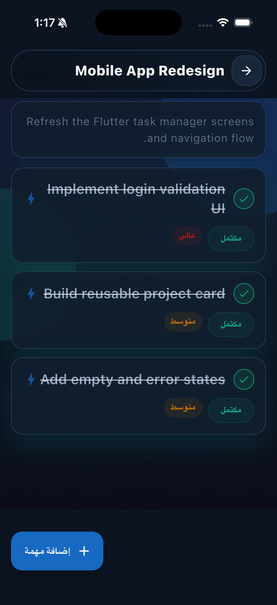
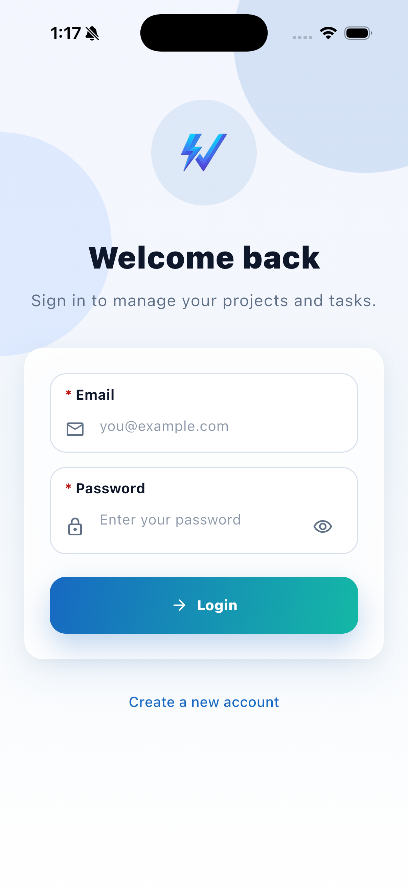
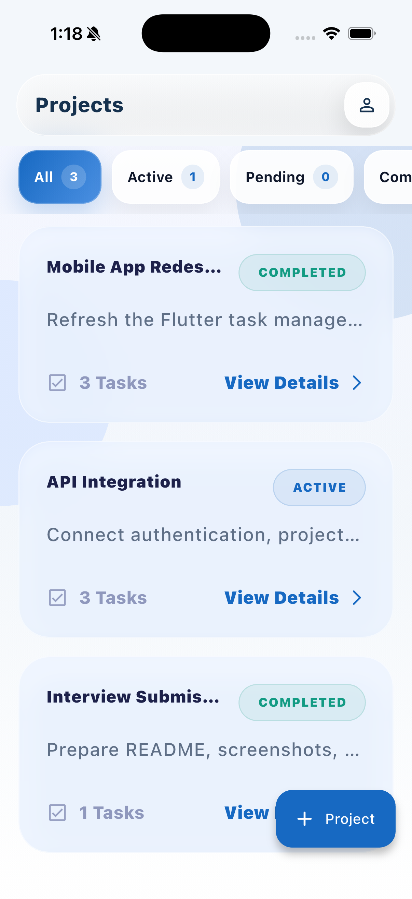
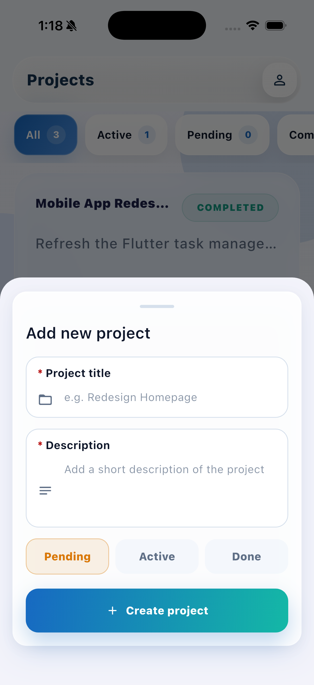

# Electro Task Manager

Flutter interview task application for managing projects and tasks with authentication, local token persistence, animated UI, dark mode, and a lightweight Node.js backend.

## Project Description

Electro Task Manager is a productivity app built with Flutter using a feature-based structure and BLoC/Cubit state management.  
The app supports:

- Splash and auth session check
- Login and registration
- Secure token storage
- Projects list with filter tabs
- Project details and tasks
- Add, complete, and delete tasks
- Profile and settings
- Dark mode toggle
- Loading, empty, and error states

## Tech Stack

- Flutter `3.35.1`
- BLoC / Cubit
- GoRouter
- GetIt
- Dio
- Flutter Secure Storage
- Easy Localization
- Node.js backend

## Dependencies

Main packages used in the app:

```yaml
flutter_bloc
go_router
get_it
dio
flutter_secure_storage
easy_localization
flutter_staggered_animations
popup_quick_actions
```

## Screenshots

Current stable assets in the repo:


<!--  -->





## Project Structure

```text
lib/
  main.dart
  core/
    config/
    data/
    resources/
    utils/
    widgets/
  modules/
    common/
      features/
        auth/
        profile/
        projects/
        splash/
        tasks/
```

## Demo Account

```text
email: demo@electro.dev
password: Password123
```

## Bundle IDs

```text
Android: com.example.electro_task_manager
iOS: com.example.electroTaskManager
```

## How to Run

### 1. Run the backend

From the workspace root:

```bash
cd backend
npm start
```

Backend runs on:

```text
http://localhost:3000
```

### 2. Run the Flutter app

From the Flutter project folder:

```bash
cd electro_task_manager
flutter pub get
```

For iOS Simulator:

```bash
flutter run --dart-define=API_BASE_URL=http://localhost:3000
```

For Android Emulator:

```bash
flutter run --dart-define=API_BASE_URL=http://10.0.2.2:3000
```

For a real device on the same Wi-Fi:

```bash
flutter run --dart-define=API_BASE_URL=http://YOUR_MAC_IP:3000
```

## Build APK

For Railway backend:

```bash
flutter build apk --release --dart-define=API_BASE_URL=https://your-railway-url
```

Generated APK path:

```text
build/app/outputs/flutter-apk/app-release.apk
```

## API Endpoints

```text
POST /api/auth/register
POST /api/auth/login
GET  /api/me

GET    /api/projects
POST   /api/projects
GET    /api/projects/:id
PATCH  /api/projects/:id
DELETE /api/projects/:id

GET    /api/projects/:projectId/tasks
POST   /api/projects/:projectId/tasks
PATCH  /api/tasks/:id
PATCH  /api/tasks/:id/done
DELETE /api/tasks/:id
```

## Notes

- Backend data is in memory for interview/demo purposes.
- Restarting the backend resets data to the initial seed.
- Protected endpoints use `Authorization: Bearer <token>`.
- Project status is synced from task completion state.

## Development Links

- [Backend README](../backend/README.md)
- [Design System](../outputs/stitch/design_system/DESIGN.md)
- [Generated Stitch Screens](../outputs/stitch/screens/)
- [Generated Stitch Code](../outputs/stitch/code/)
